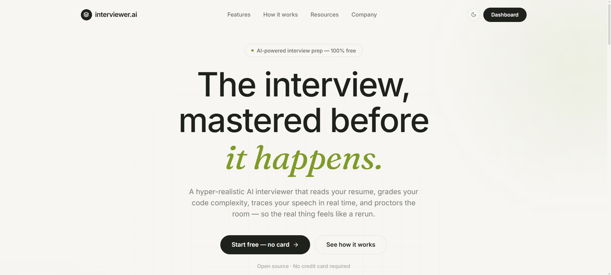
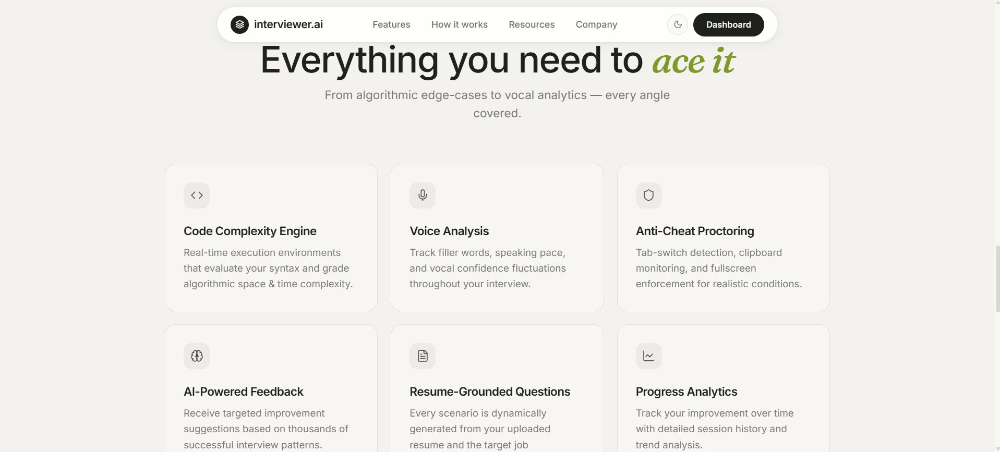
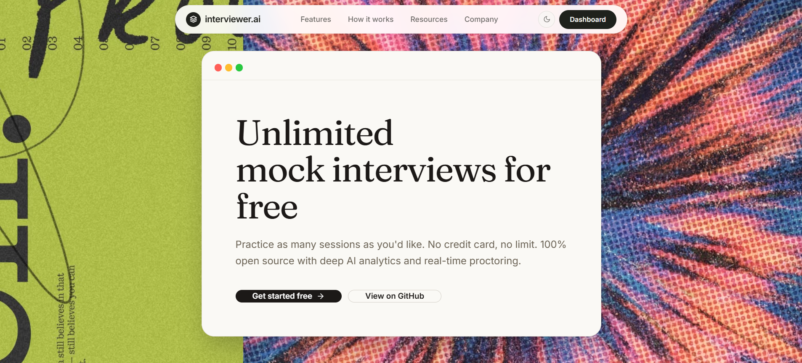

<div align="center">

# interviewer.ai

An end-to-end AI interview platform that parses resumes, generates role-aware questions, runs voice-enabled interview flows, evaluates answers, maps interview evidence back to the resume, and stores interview history — wrapped in a modern aurora-themed React frontend with a painterly hero, dedicated marketing pages, and a Forbes-style newsroom.

[](https://www.python.org/downloads/)
[](https://fastapi.tiangolo.com/)
[](https://react.dev/)
[](https://www.typescriptlang.org/)
[](https://vitejs.dev/)
[](https://tailwindcss.com/)
[](https://tanstack.com/query)
[](https://streamlit.io/)
[](https://mlflow.org/)
[](https://dvc.org/)
[](https://www.mysql.com/)
[](https://valkey.io/)
[](https://www.docker.com/)
[](https://kubernetes.io/)
[](https://www.terraform.io/)
[](https://aws.amazon.com/)
[](https://argo-cd.readthedocs.io/)
[](https://prometheus.io/)
[](https://grafana.com/)
[](https://grafana.com/oss/loki/)
[](https://www.jaegertracing.io/)
[](https://trivy.dev/)
[](https://codeql.github.com/)
[](https://www.sonarsource.com/products/sonarqube/)
[](https://github.com/features/actions)

</div>

---

## Screenshots

| Landing Page | Features Section | Free Plan / Forever Free |
|:---:|:---:|:---:|
|  |  |  |

> **interviewer.ai** — a hyper-realistic AI mock-interview platform with resume parsing, speech confidence analytics, code complexity grading, and strict anti-cheat proctoring.

---

## Table of Contents

- [Screenshots](#screenshots)
- [What is in this repo](#what-is-in-this-repo)
- [Feature modules](#feature-modules)
- [Architecture and runtime flow](#architecture-and-runtime-flow)
- [Tech stack](#tech-stack)
- [Local development](#local-development)
- [Docker compose](#docker-compose)
- [DevOps and CI/CD](#devops-and-cicd)
- [AWS Deployment](#aws-deployment)
- [Production Microservices and Kubernetes](#production-microservices-and-kubernetes)
- [Observability and SEO](#observability-and-seo)
- [Environment variables](#environment-variables)
- [API reference (implemented routes)](#api-reference-implemented-routes)
- [Frontend scripts](#frontend-scripts)
- [Testing](#testing)
- [Troubleshooting](#troubleshooting)
- [Project structure](#project-structure)

---

## What is in this repo

This repository contains three runnable surfaces:

1. **FastAPI backend** (`app/`) — core APIs for parsing resumes, generating interview questions, auth/account management, ASR/TTS integrations, evaluation, and MySQL-backed user data/history.
2. **React + TypeScript frontend** (`frontend/`) — the interviewer.ai web app: an aurora-themed landing page with a painterly hero, dedicated `/features` and `/how-it-works` marketing pages, a Forbes-style newsroom, and the upload-to-results interview UI including auth, account settings, history export, and the Resume Proof Map.
3. **Streamlit app** (`streamlit_app.py`) — optional Python-only UI for simpler workflows and demos.

Primary backend entry points:

- `app.main:app` for Uvicorn (`uvicorn app.main:app ...`)
- `app.py` for Hugging Face Spaces-style root launch
- `run.py` for an optional local launcher (supports `--ngrok`)

---

## Feature modules

The backend is organized around ten practical modules, plus a set of newer product features layered on top of the core interview loop.

### Module 1 — Resume parsing

- Accepts PDF, DOCX, and TXT uploads.
- Extracts structured candidate information.
- Exposes health and status metadata.

### Module 2 — Question generation

- Generates interview questions from parsed resume context.
- Supports interview session bootstrap endpoints.
- Supports follow-up question generation.

### Module 3 — Text-to-speech (TTS)

- Converts prompts/questions to audio.
- Supports provider fallback and cached generation.
- Includes specialized interview intro/outro and sequence endpoints.

### Module 4 — Speech recognition (ASR)

- Primary path: browser transcript ingestion.
- Fallback path: backend audio transcription.
- Includes session lifecycle operations (start/upload/correct/re-record/submit).
- Frontend microphone capture is handled by a reusable `useAudioRecorder` hook (`frontend/src/hooks/useAudioRecorder.ts`) that tracks recording state, elapsed time, and live volume level.

### Module 5 — Answer evaluation

- Single-answer scoring endpoint.
- Batch evaluation endpoint for full interview summary.
- Rubric and health endpoints.

### Module 6 — Interview history and replay

- Persists completed interview summaries plus detailed evaluation payloads.
- Supports list, clear, export, and detail/review workflows in the frontend.

### Module 7 — Authentication and account management

- Cookie-backed and bearer-token-backed authentication.
- Sign up, sign in, Google/GitHub OAuth, profile updates, and account deletion.
- Forgot-password flow that emails a real reset link over SMTP (`app/services/email_service.py`); falls back to on-screen tokens in DEBUG when SMTP is not configured.
- MySQL-backed session snapshots and user-scoped history.

### Module 8 — Daily challenge

- **Daily Challenge** — a rotating practice prompt (DSA, system design, behavioral) to encourage regular use, with streak tracking.

### Module 9 — OpenTelemetry tracing

- Exports distributed traces through OpenTelemetry when enabled.
- Uses Jaeger as the standard open-source trace backend in the provided deployment stack.
- Falls back cleanly when tracing packages or exporters are not configured.

### Module 10 — Retrieval-Augmented Generation (RAG)

- Grounds every LLM call in retrieved context (candidate resume/JD chunks, a role reference Q&A bank, and optional per-company docs) so questions and scores cite real evidence rather than model priors.
- Powers grounded question generation, rubric-based answer scoring, near-duplicate ("copied answer") proctoring, adaptive difficulty, per-company context, and grounded final reports (`/rag/*` routes).
- FAISS-backed vector store (`app/services/rag/faiss_store.py`) with per-session, per-company, reference-bank, and answer namespaces persisted under `RAG_INDEX_DIR`; PII-redacted retrieval audit trail and a `VectorStore` protocol for swapping in pgvector/Qdrant later.
- Embedding is the CPU-bound hot path (`app/services/rag/embedder.py`), tuned for concurrent load via a query-embed LRU cache, bounded torch threads (`RAG_TORCH_NUM_THREADS`), and batch encoding at session init.
- See `app/services/rag/README.md` for full architecture, namespaces, config, and the offline quality/CI eval gate.

### Module 11 — AI Panel Interview

- Simulates a multi-interviewer panel with distinct personas (`app/services/panel_service.py`, `/api/v1/panel` routes).
- `personas` lists the available interviewer personas; `react` returns per-persona reactions to an answer; `deliberate` produces a combined panel deliberation/verdict.
- Pairs with multi-persona TTS accents so each panelist has a distinct voice.

---

## AI Confidence Pulse & Resume Proof Map

Two of the most differentiated features in the product — both live entirely in the frontend, layered on top of existing ASR/evaluation data with no new backend dependency required to demo them.

### AI Confidence Pulse (`frontend/src/components/ConfidencePulse.tsx`)

A real-time communication-quality readout that runs alongside the voice interview, not just a post-hoc score:

- **Filler-word detection** — flags "um", "uh", "like", "you know" style filler patterns as the candidate speaks (backed by `app/services/filler_word_detector.py` on the API side).
- **Words-per-minute (WPM) pacing** — a live `WpmPanel` (`frontend/src/components/WpmPanel.tsx`) shows whether the candidate is speaking too fast, too slow, or in a comfortable range.
- **Confidence trend line** — a lightweight, animated pulse visualization so the candidate (or a reviewer replaying history) can see confidence rise/fall across the interview instead of one aggregate number.
- Surfaces in both the live interview screen and the post-interview results/history review, so coaching feedback is consistent whether you're live or reviewing later.

**Why it matters:** most mock-interview tools only grade *content*. This grades *delivery* — the thing that actually tanks real interviews even when the answer is technically correct.

### Resume Proof Map (`frontend/src/components/ResumeProofMap.tsx`)

Cross-references claims made on the uploaded resume against what the candidate actually said during the interview:

- Extracts claim-worthy statements from the parsed resume (skills, projects, impact metrics).
- Matches each claim against interview transcript evidence collected during the session.
- Visually flags claims that were **substantiated** (the candidate backed it up live) vs. **unsubstantiated** (asserted on paper, never actually discussed or defended).
- Doubles as authenticity/plagiarism-adjacent tooling — paired with `app/services/plagiarism_service.py` on the backend, it gives a fuller picture of resume-vs-reality consistency than either signal alone.

**Why it matters:** it turns the interview from "did they answer this question well" into "does the resume hold up under actual questioning" — closer to how a skeptical human interviewer actually evaluates a candidate.

Both features are pure frontend consumers of existing evaluation/ASR data — no extra provider keys or infrastructure needed to run them locally; they light up automatically once `npm run dev` is running against a backend with ASR/evaluation configured.

## New: Post-Interview Growth Tools

Three genuinely new, candidate-facing features, all shipped in the frontend on top of data the app already collects — no new provider keys required.

### PDF scorecard export (`frontend/src/components/ResultsPage.tsx`)

- A "Download PDF Scorecard" button on the Results page renders the candidate's overall score, grade, category breakdown, authenticity coaching, and full per-question feedback into a polished, shareable PDF (via `jspdf`).
- Sits alongside the existing Markdown export, so candidates can hand a clean report straight to a mentor or career coach without copy-pasting.

### Interview readiness score & practice streak (`frontend/src/components/AnalyticsDashboard.tsx`)

- A single rolling 0–100 "Interview Readiness Score" widget on the Analytics Dashboard, blending recent interview performance and consistency — so candidates get one number that tells them "am I ready yet?" instead of hunting across separate progress bars.
- Pairs with a daily-challenge practice streak to encourage the daily-practice habit that's proven to move outcomes.

---

## Architecture and runtime flow

```text
Frontend (React/Vite) ─────────────┐
                                   ├──> FastAPI backend (app/main.py)
Streamlit UI (optional) ───────────┘            |
                                                |
                                                +--> Resume parser services
                                                +--> Question generator + LLM routing
                                                +--> TTS services
                                                +--> ASR services
                                                +--> Evaluator services
                                                +--> MySQL user/session/history storage
```

Typical flow:

1. Upload resume (`/parse-resume`).
2. Generate interview questions (`/generate-questions` or start interview endpoints).
3. Run interview with TTS + ASR support, with live Confidence Pulse feedback.
4. Evaluate answers (single or batch).
5. Persist final outcome to MySQL-backed history APIs; review it in the dashboard, including the Resume Proof Map.

---

## Tech stack

### Backend

- Python 3.14.3
- FastAPI + Uvicorn
- Pydantic + pydantic-settings
- MySQL for user, session, history, and account state
- Loguru
- MLflow experiment tracking for NER training
- DVC pipeline orchestration for reproducible model runs
- Optional Rust accelerator for preprocessing hot paths

### Frontend

- React 18 + TypeScript
- Vite
- Tailwind CSS + Radix UI ecosystem
- React Router
- TanStack Query
- Framer Motion (with `LazyMotion`/`m` and `MotionConfig` for reduced-motion support)

### Product highlights in the current UI

- Aurora design system (deep slate-indigo palette, glass surfaces, SF Pro typography) with a painterly CSS-only hero background
- Dedicated `/features` and `/how-it-works` marketing pages (no dead `#` navbar links)
- Forbes-style newsroom with tightened, ad-free layout
- Resume-tailored question generation
- Voice interview flow with TTS/ASR fallback
- AI Confidence Pulse live communication analytics (filler words, pacing/WPM, confidence trend)
- Resume Proof Map for validating resume claims against interview evidence
- RAG-grounded question generation and answer scoring (FAISS retrieval over resume/JD, role rubric bank, and company docs)
- Daily Challenge practice streak
- History export in JSON and Markdown
- Account settings, email-based password reset, and account deletion

### Optional AI/Provider integrations

- **LLM providers:** xAI, Claude, AIMLAPI, Mistral, OpenRouter, Gemini, Groq, Hugging Face
- **ASR providers:** OpenAI Whisper API, Deepgram, Google, Vosk, local Whisper route
- **TTS providers:** ElevenLabs, gTTS, offline fallback

> You can run the app with partial provider configuration; unavailable providers are skipped/fallback logic applies.

---

## Local development

### Prerequisites

- Python 3.14.3
- Node.js 18+ (Node 20 recommended)
- npm

### 1) Clone and set up Python environment

> This repository is private. Cloning requires GitHub access to `BhautikVekariya21/ai-interview` (SSH key or a PAT with `repo` scope).

```bash
git clone https://github.com/BhautikVekariya21/ai-interview.git
cd ai-interview
python -m venv .venv
source .venv/bin/activate  # Windows: .venv\Scripts\activate
pip install -r requirements.txt
pip install -r requirements-dev.txt
```

### 2) Run backend (FastAPI)

```bash
uvicorn app.main:app --host 0.0.0.0 --port 8000 --reload
```

Backend URLs:

- API root: `http://localhost:8000/`
- Swagger docs: `http://localhost:8000/docs`
- ReDoc: `http://localhost:8000/redoc`
- Health: `http://localhost:8000/health`

### 3) Run frontend (Vite)

```bash
cd frontend
npm install
npm run dev
```

Frontend URL:

- `http://localhost:5173`

### 4) Optional Streamlit interface

```bash
streamlit run streamlit_app.py
```

### 5) Optional launcher with ngrok helper

```bash
python run.py
# or
python run.py --ngrok
```

### 6) Reproducible NER training with DVC + MLflow

The local resume NER model training flow is tracked through DVC and can optionally log experiments to MLflow.

```bash
dvc repro train_ner
```

This stage reads `params.yaml`, writes the trained model to `saved_models/ner_bilstm_crf/`, and stores run metrics in `reports/ner_training_metrics.json`.

To enable MLflow tracking locally:

```bash
MLFLOW_ENABLED=true
MLFLOW_TRACKING_URI=file:./mlruns
MLFLOW_EXPERIMENT_NAME=resume-ner
```

You can also run the trainer directly:

```bash
python -m app.ml.train_ner --num-samples 5000 --epochs 30
```

### 7) Optional Rust acceleration

The backend can optionally use a native Rust extension for the hottest text-processing operations in resume parsing, plagiarism/authenticity heuristics, and parser fallback extraction. The Python implementation remains the default fallback, so the app still runs even when Rust is not installed.

Build the accelerator after installing Rust and Cargo:

```bash
make build-rust-accel
```

The extension source lives in `rust/ai_interview_accel/` and is loaded automatically when available.

---

## Docker compose

Run app + MySQL + Valkey using the provided compose file:

```bash
docker-compose up --build
```

Default mapped ports:

- Backend: `http://localhost:8000` (container internal port `7860`)
- Valkey: `localhost:6379`
- MySQL: `localhost:3306`

Stop:

```bash
docker-compose down
```

The production container builds the React frontend inside the Docker image and serves the compiled assets from FastAPI, so the backend image is self-contained for deployment.

---

## DevOps and CI/CD

This repository includes a practical baseline CI/CD setup. There is **no Dependabot and no repo-automation bot layer** — those were removed after bot-authored PRs/commits caused problems on this project, so all dependency and workflow changes are made and reviewed by hand.

- GitHub Actions CI at `.github/workflows/ci.yml`
- GitHub Actions CD at `.github/workflows/cd.yml`
- Release drafting at `.github/workflows/release-drafter.yml`
- Dedicated infrastructure checks at `.github/workflows/infra.yml`
- Repository label sync at `.github/workflows/repo-labels.yml`
- PR labeling automation at `.github/workflows/labeler.yml` and `.github/workflows/pr-size-labeler.yml`
- Issue forms under `.github/ISSUE_TEMPLATE/`
- Contributor/issue hygiene at `.github/workflows/greetings.yml`, `.github/workflows/auto-assign.yml`, `.github/workflows/assign-to-me.yml`, and `.github/workflows/lock-threads.yml`
- Stale thread cleanup at `.github/workflows/stale.yml`
- Markdown link checking at `.github/workflows/check-links.yml`
- GitHub workflow linting at `.github/workflows/actionlint.yml`
- CodeQL code scanning at `.github/workflows/codeql.yml`
- Dependency review at `.github/workflows/dependency-review.yml`
- Dependency vulnerability auditing at `.github/workflows/dependency-audit.yml`
- Dockerfile linting at `.github/workflows/hadolint.yml`
- Kubernetes quality scoring at `.github/workflows/k8s-quality.yml`
- Manual redeploy workflow at `.github/workflows/manual-redeploy.yml`
- Scheduled smoke tests at `.github/workflows/smoke-tests.yml` (backed by `.github/scripts/http_smoke.py`)
- Secret scanning at `.github/workflows/gitleaks.yml`
- OpenSSF Scorecards at `.github/workflows/scorecards.yml`
- GitHub Pages frontend deploy at `.github/workflows/deploy-pages.yml`
- Optional AWS EKS deployment automation via `deploy/aws/scripts/deploy-eks.sh`
- MLflow tracking server via `docker/mlflow.Dockerfile`
- dedicated backend and frontend production Dockerfiles under `docker/`
- Production compose stack at `deploy/production/docker-compose.prod.yml`
- Remote deploy helper at `deploy/scripts/deploy.sh`
- Root `.env.example` and production `deploy/production/.env.example`
- `.dockerignore` for smaller, safer image builds

### CI pipeline

The CI workflow runs:

- Backend pytest suite with Valkey-compatible cache and MySQL service containers
- Frontend lint, tests, and production build
- Lightweight NER training smoke test with MLflow file-backed tracking
- Docker image build validation
- `docker compose config` sanity checks

The infrastructure workflow adds:

- `Terraform` fmt/init/validate checks for AWS infrastructure
- `kubeconform` validation for Kubernetes manifests
- `Checkov` infrastructure security scanning for Terraform, Kubernetes, Dockerfiles, and GitHub Actions

### Community and repo hygiene

The repository keeps a small, human-reviewed GitHub community layer — no bot writes to issues, discussions, or PRs on its own:

- issue forms for bug reports, feature requests, and support requests under `.github/ISSUE_TEMPLATE/`
- a PR template and `CODEOWNERS` for cleaner review handoff
- path-based PR labels via `.github/workflows/labeler.yml` and size labels via `pr-size-labeler.yml`
- stale cleanup (`stale.yml`) and closed-thread locking (`lock-threads.yml`)
- welcome messages for first-time contributors (`greetings.yml`) and auto-assignment of issues/PRs (`auto-assign.yml`, `assign-to-me.yml`)
- `hadolint` for Dockerfile quality and best practices
- `Kubernetes Quality` for rendered manifest scoring with `kube-score`

`CONTRIBUTORS.md` and `docs/wiki-source/` are maintained by hand, not by automation.

> **Why no bots:** this repo previously ran a larger stack of AI/repo-automation bots (dependency updates, AI-triage replies, auto-generated issues/PRs, wiki sync, ops bots). Bot-authored commits ended up causing real problems on the project, so all of that automation — including Dependabot — has been removed. Dependencies, docs, and infra changes are now made and reviewed by maintainers directly.

### Automated code and dependency security checks

The repository layers several vulnerability-detection systems:

- `bandit` in the main CI workflow for Python application security smells
- `Trivy` in CI for filesystem and container image vulnerability scanning
- `Checkov` in infrastructure checks for Terraform, Kubernetes, Dockerfiles, and GitHub Actions
- `CodeQL` for semantic code scanning across Python and JavaScript/TypeScript
- `pip-audit` and `npm audit` in the dependency audit workflow
- `gitleaks` for committed secret detection
- `OpenSSF Scorecards` for repository hardening guidance

### CD pipeline

The CD workflow:

1. Builds and pushes separate backend and frontend images to GitHub Container Registry (`ghcr.io`)
2. Tags them with `latest` and the commit SHA
3. Publishes build provenance and SBOM metadata for pushed images
4. Optionally deploys to a remote Docker host over SSH if deploy secrets are configured
5. Optionally deploys to AWS EKS if AWS secrets are configured
6. Runs post-deploy smoke checks when health-check URLs are configured

### Frontend deployment (GitHub Pages)

The frontend is deployed to GitHub Pages via `.github/workflows/deploy-pages.yml`:

1. Triggers on pushes to `main` that touch `frontend/**` (or manually via `workflow_dispatch`)
2. Installs dependencies and runs `npm run build` inside `frontend/`
3. Copies `dist/index.html` to `dist/404.html` for SPA fallback routing
4. Uploads and publishes `frontend/dist` as a GitHub Pages artifact

The published site is served at the `/ai-interview/` base path from the `BhautikVekariya21/ai-interview` repository's Pages environment. The frontend build is configured with this base path (see `frontend/vite.config.ts`), and the API base URL is provided separately so the statically hosted SPA can reach the backend.

### Release and recovery automation

The repository includes a lightweight release and recovery layer:

- `Release Drafter` maintains a draft release note on `main`
- `Manual Redeploy` can redeploy an existing image tag to the server or AWS EKS
- `Smoke Tests` can run on a schedule or on demand against live health endpoints

This gives the repo a safer loop for deploy, verify, and recover without requiring ad hoc shell access.

### Additional DevOps tooling

The repo also includes optional configurations for:

- `External Secrets Operator` with AWS Secrets Manager manifests under `k8s/optional-tools/external-secrets/`
- `KEDA` autoscaling from AWS SQS under `k8s/optional-tools/keda/`
- `Argo Rollouts` canary deployment examples under `k8s/optional-tools/argo-rollouts/`

### Required GitHub secrets for deployment

Configure these repository or environment secrets before using automatic deploys:

```bash
DEPLOY_HOST=
DEPLOY_USER=
DEPLOY_SSH_KEY=
```

`GITHUB_TOKEN` is used automatically for GHCR publishing.

For the optional AWS deployment job, configure:

```bash
AWS_ROLE_TO_ASSUME=
AWS_REGION=
AWS_ACCOUNT_ID=
EKS_CLUSTER_NAME=
ECR_REPOSITORY_PREFIX=ai-interview-prod
```

For live smoke checks and post-deploy verification, configure these repository variables when you have stable URLs:

```bash
DEPLOY_HEALTHCHECK_URL=
AWS_DEPLOY_HEALTHCHECK_URL=
```

Recommended values are direct `/health` endpoints for the environments you want GitHub Actions to verify after deployment.

### Recommended GitHub repository settings

Apply these GitHub settings alongside the committed workflow files:

1. Enable private vulnerability reporting in the Security tab.
2. Require these status checks on `main`: `CI`, `Infrastructure Checks`, `actionlint`, `CodeQL`, `Dependency Review`, `Dependency Audit`, `hadolint`, `Kubernetes Quality`, and `gitleaks`.
3. Keep workflow permissions on the default `GITHUB_TOKEN` as restrictive as possible.
4. Enable GitHub code scanning alerts so CodeQL and SARIF uploads are visible in Security.
5. Review the draft release generated by Release Drafter before publishing versioned GitHub releases.
6. Do not re-enable Dependabot or add bot-write tokens (`REPO_BOT_TOKEN` or similar) unless a maintainer explicitly decides to reintroduce automated PRs — see the note in [DevOps and CI/CD](#devops-and-cicd).

### Production server setup

On the target server:

1. Copy `deploy/production/.env.example` to `deploy/production/.env`
2. Fill in your real app secrets and provider keys
3. Ensure Docker and Docker Compose are installed
4. Ensure the deploy user can run Docker

Manual deployment command on the server:

```bash
bash ~/ai-interview/deploy.sh
```

---

## AWS Deployment

AWS is a first-class deployment target in this repo.

Included AWS deployment assets:

- Terraform for VPC, EKS, ECR, S3, EFS, and CloudWatch under `deploy/aws/terraform/`
- A Terraform usage guide at `deploy/aws/terraform/README.md`
- An EKS deploy script under `deploy/aws/scripts/deploy-eks.sh`
- An AWS-specific Kubernetes overlay under `k8s/overlays/aws/`
- An Argo CD application for the AWS overlay at `deploy/argocd/ai-interview-aws-application.yaml`
- A GitHub Actions CD job that can deploy to EKS when AWS secrets are configured

Planned AWS service mapping in this repo:

- `Amazon EKS` for the Kubernetes control plane
- `Amazon ECR` for backend and frontend container images
- `Amazon S3` for MLflow artifact storage
- `Amazon EFS` for shared persistent filesystem workloads
- `Amazon CloudWatch` for workload logs and observability integration
- `Amazon ElastiCache for Valkey` for managed low-latency caching
- `Amazon RDS for PostgreSQL` for managed relational storage
- `Amazon OpenSearch Service` for managed search and indexing
- `Amazon SQS` for asynchronous queue-based processing
- `Amazon SNS` for notifications and event fan-out
- `Amazon EventBridge` for event routing and integration workflows
- `AWS Glue` and `Amazon Athena` for S3-native analytics
- `AWS KMS` for managed encryption keys
- `AWS Secrets Manager` for runtime secret storage
- `AWS Certificate Manager (ACM)` for TLS certificates
- `Amazon Route53` for DNS-backed certificate validation and domain management
- `AWS Load Balancer Controller` / `ALB Ingress` via the AWS overlay

Bootstrap flow:

```bash
cd deploy/aws/terraform
cp terraform.tfvars.example terraform.tfvars
terraform init
terraform plan -out tfplan
terraform apply tfplan
```

Then deploy the app to EKS with:

```bash
AWS_REGION=ap-south-1 AWS_ACCOUNT_ID=123456789012 EKS_CLUSTER_NAME=ai-interview-eks IMAGE_TAG=latest deploy/aws/scripts/deploy-eks.sh
```

Before applying the AWS overlay, replace placeholder values like the IRSA role ARN and hostname in:

- `k8s/overlays/aws/backend-serviceaccount.yaml`
- `k8s/overlays/aws/ingress-aws-alb.yaml`

The AWS database layout supports a primary/replica topology through Terraform, which is the modern AWS equivalent of a traditional master/slave deployment pattern for relational workloads.

## Production Microservices and Kubernetes

Production is set up as a microservice-oriented deployment topology:

- `frontend` service for the React SPA
- `api` service for the FastAPI backend
- `nginx` edge gateway for routing
- `valkey` cache service
- `grafana loki` centralized log storage
- `promtail` log shipping agent
- `jaeger` distributed tracing backend
- `alertmanager` alert routing and notification hub
- `prometheus` monitoring service
- `grafana` dashboard service

Docker production files:

- `docker/backend.Dockerfile`
- `docker/frontend.Dockerfile`
- `docker/frontend-nginx.conf`
- `deploy/production/docker-compose.prod.yml`

Kubernetes manifests live in:

- `k8s/`

Apply the base manifests with:

```bash
kubectl apply -k k8s
```

Important note:
The runtime topology is split into deployable services, but the application logic itself is still one FastAPI backend codebase. That means this is a production microservice-style deployment architecture, not yet a full domain-level backend refactor into independently owned business microservices.

### Helpful local ops commands

If you use `make`, the root `Makefile` includes:

```bash
make lint-backend
make format-backend
make security-backend
make precommit
make build-rust-accel
make test-backend
make train-ner-smoke
make test-frontend
make lint-frontend
make build-frontend
make docker-build
make compose-config
make dev-up
make dev-down
make mlflow-up
make mlflow-down
make tf-fmt
make tf-validate
```

---

## Observability and SEO

The production deployment includes:

- `nginx` as the public reverse proxy
- `prometheus` for application metrics scraping
- `grafana` with a provisioned Prometheus datasource
- `grafana loki` for centralized logs
- `promtail` for log collection
- `jaeger` for distributed tracing
- `alertmanager` for alert routing
- `trivy` in CI for filesystem and container vulnerability scanning
- `sonarqube` support for code-quality gates
- a starter dashboard for request volume and latency
- a FastAPI `/metrics` endpoint for Prometheus scraping

Production observability files:

- `deploy/production/nginx/nginx.conf`
- `deploy/production/prometheus/prometheus.yml`
- `deploy/production/loki/config.yml`
- `deploy/production/promtail/config.yml`
- `deploy/production/alertmanager/alertmanager.yml`
- `deploy/production/prometheus/alerts.yml`
- `deploy/production/grafana/provisioning/datasources/prometheus.yml`
- `deploy/production/grafana/provisioning/dashboards/dashboards.yml`
- `deploy/production/grafana/provisioning/dashboards/json/app-overview.json`
- `deploy/argocd/ai-interview-application.yaml`
- `deploy/quality/docker-compose.sonarqube.yml`
- `sonar-project.properties`

Default production ports:

- Nginx: `80`
- Loki: `3100`
- Promtail: `9080`
- Alertmanager: `9093`
- Jaeger UI: `16686`
- Jaeger OTLP gRPC: `4317`
- Prometheus: `9090`
- Grafana: `3000`

SEO improvements included:

- canonical URL tags
- Open Graph and Twitter metadata
- `robots.txt` sitemap reference
- `sitemap.xml`

Before production launch, replace placeholder URLs like `https://interviewer.ai/` and `https://interviewer.ai/og-image.png` with your real domain and social preview image.

### Embedding throughput

The RAG embedder (`app/services/rag/embedder.py`) is the CPU-bound hot path under
concurrent load: the SentenceTransformer model is a process-wide singleton and each
`encode()` runs under the GIL, so many `asyncio.to_thread` embed calls serialize on
the same model. Three tuning levers manage this:

- **Query-embedding cache.** `embed_one()` is memoized with a bounded exact-match LRU
  (`~1000` entries, `_QUERY_CACHE_SIZE`). Repeated identical queries — e.g.
  `detect_similarity` re-checking the same answer against the canned and past-answer
  indices — reuse a cached vector instead of re-encoding. The cache is per-`Embedder`
  instance, so changing `RAG_EMBEDDING_MODEL` builds a fresh embedder with an empty
  cache and no stale vectors leak across model versions. Batch `embed()` (session-init
  and reference-bank ingest) is intentionally *not* cached — those texts are large and
  unique.
- **Bounded torch threads.** `torch.set_num_threads()` is capped at init to
  `min(4, os.cpu_count())` (override with `RAG_TORCH_NUM_THREADS`) instead of PyTorch's
  default of all cores. **Tradeoff:** a single embed call can no longer use every core,
  so its best-case latency ceiling is a little higher; in exchange, N concurrent embeds
  no longer each fan out across all cores and oversubscribe the CPU, so aggregate
  throughput under load is substantially better. Raise the value on a host dedicated to
  single-request latency; lower it (or leave the default) on a shared, high-concurrency host.
- **Batch encoding at session init.** `build_session_index` embeds all resume + JD
  chunks in one `encode(list_of_texts)` call rather than a per-chunk loop, which is far
  more efficient on both CPU and GPU.

Two Prometheus metrics make this visible in Grafana: `embedding_cache_events_total`
(hit-rate = `hit / (hit + miss)`) and `embedding_duration_seconds` (per-`encode()`
wall time, labelled `embed_one` / `embed_batch`). To measure the concurrency crossover
point on a target host, use the manual load-test script
`scripts/rag_load_test.py` (see its module docstring for usage).

---

## Environment variables

Create a `.env` file in the repository root (or export in your shell).

### Core app settings

```bash
APP_NAME="AI Interview System"
APP_VERSION="2.0.0"
DEBUG=true
HOST=0.0.0.0
PORT=8000
```

### LLM provider keys (set whichever providers you use)

```bash
XAI_API_KEY=
CLAUDE_API_KEY=
AIML_API_KEY=
MISTRAL_API_KEY=
OPENROUTER_API_KEY=
GEMINI_API_KEY=
GROQ_API_KEY=
HUGGINGFACE_API_KEY=
```

### TTS settings

```bash
ELEVENLABS_API_KEY=
TTS_PROVIDER=gtts
TTS_LANGUAGE=en
TTS_CACHE_ENABLED=true
TTS_CACHE_DIR=audio_cache
```

### ASR settings

```bash
OPENAI_API_KEY=
DEEPGRAM_API_KEY=
ASSEMBLYAI_API_KEY=
ASR_PROVIDER=
ASR_STREAM_ENABLED=true
WHISPER_MODEL_SIZE=tiny
```

### Cache / Valkey

```bash
CACHE_ENABLED=true
CACHE_DEFAULT_TTL_SECONDS=3600
VALKEY_URL=redis://localhost:6379/0
REDIS_URL=redis://localhost:6379/0
```

### MySQL persistence

```bash
MYSQL_HOST=localhost
MYSQL_PORT=3306
MYSQL_USER=root
MYSQL_PASSWORD=change-me-in-prod
MYSQL_DATABASE=ai_interview
```

### Auth / session settings

```bash
JWT_SECRET_KEY=
JWT_ALGORITHM=HS256
JWT_EXPIRATION_DAYS=30
FRONTEND_BASE_URL=http://localhost:5173
```

### Email (SMTP) for password reset

```bash
SMTP_HOST=smtp.gmail.com
SMTP_PORT=587
SMTP_USER=
SMTP_PASSWORD=          # for Gmail, use an App Password
SMTP_USE_TLS=true
SMTP_FROM_EMAIL=
SMTP_FROM_NAME="AI Interview"
```

Leave these blank to skip real email sending — in DEBUG mode the reset link is returned in the API response instead.

### Logging and GitOps

```bash
LOKI_PORT=3100
PROMTAIL_PORT=9080
```

### Tracing and alerting

```bash
ALERTMANAGER_PORT=9093
JAEGER_UI_PORT=16686
JAEGER_OTLP_GRPC_PORT=4317
OTEL_ENABLED=false
OTEL_SERVICE_NAME=ai-interview-api
OTEL_EXPORTER_OTLP_ENDPOINT=http://jaeger:4317
OTEL_EXPORTER_OTLP_INSECURE=true
```

### ML experiment tracking

```bash
MLFLOW_ENABLED=false
MLFLOW_TRACKING_URI=file:./mlruns
MLFLOW_EXPERIMENT_NAME=resume-ner
MLFLOW_ARTIFACT_PATH=artifacts
RUST_ACCELERATION_ENABLED=true
```

---

## API reference (implemented routes)

> Prefixes below are exactly as defined in backend route files. For request/response schemas, use live docs at `/docs`.

### Root + app-level health

| Method | Path      | Purpose                            |
| ------ | --------- | ----------------------------------- |
| GET    | `/`       | Root service info                  |
| GET    | `/health` | App-level health and module status |
| GET    | `/status` | Core status                        |
| GET    | `/health` | Parser-centric health              |
| GET    | `/tracing/status` | OpenTelemetry tracing status |

### Core interview routes

| Method | Path                      |
| ------ | ------------------------- |
| POST   | `/parse-resume`           |
| POST   | `/generate-questions`     |
| POST   | `/questions/generate`     |
| POST   | `/start-interview`        |
| POST   | `/start-interview-stream` |
| POST   | `/follow-up-question`     |
| POST   | `/tts`                    |
| GET    | `/supported-skills`       |
| GET    | `/ner-tags`               |
| GET    | `/llm-status`             |

### TTS routes (`/tts`)

| Method | Path                                    |
| ------ | ---------------------------------------- |
| POST   | `/speak`                                |
| GET    | `/speak`                                |
| POST   | `/stream`                               |
| POST   | `/interview/question/{question_number}` |
| POST   | `/interview/full-sequence`              |
| GET    | `/voices`                               |
| GET    | `/voices/presets`                       |
| POST   | `/voices/preview/{voice_id}`            |
| POST   | `/detect-language`                      |
| GET    | `/config`                               |
| GET    | `/usage`                                |
| GET    | `/stats`                                |
| GET    | `/cache/status`                         |
| DELETE | `/cache/clear`                          |
| GET    | `/health`                               |
| POST   | `/interview/intro`                      |
| POST   | `/interview/intro/with-resume`          |
| POST   | `/interview/outro`                      |
| POST   | `/interview/outro/with-evaluation`      |
| POST   | `/interview/encouragement`              |
| POST   | `/interview/followup-intro`             |
| GET    | `/interview/script-status`              |

### ASR routes (`/asr`)

| Method | Path                                         |
| ------ | --------------------------------------------- |
| POST   | `/transcript`                                |
| POST   | `/browser-transcript`                        |
| POST   | `/transcribe`                                |
| POST   | `/transcribe-simple`                         |
| POST   | `/session/upload`                            |
| POST   | `/session/start`                             |
| POST   | `/session/correct`                           |
| POST   | `/session/re-record`                         |
| POST   | `/session/submit`                            |
| GET    | `/session/{session_id}/{question_id}/status` |
| GET    | `/session/{session_id}/all-answers`          |
| POST   | `/analyze-fillers`                           |
| GET    | `/config`                                    |
| GET    | `/stats`                                     |
| GET    | `/providers`                                 |
| GET    | `/health`                                    |
| GET    | `/recordings`                                |

### Evaluation routes (`/evaluation`)

| Method | Path               |
| ------ | ------------------ |
| POST   | `/evaluate`        |
| POST   | `/evaluate-batch`  |
| POST   | `/evaluate-simple` |
| GET    | `/rubric`          |
| GET    | `/health`          |

### Auth routes (`/auth`)

| Method | Path               |
| ------ | ------------------ |
| GET    | `/health`          |
| POST   | `/signup`          |
| POST   | `/login`           |
| GET    | `/me`              |
| PATCH  | `/profile`         |
| DELETE | `/account`         |
| POST   | `/logout`          |
| POST   | `/forgot-password` |
| POST   | `/reset-password`  |
| POST   | `/oauth/{provider}` |

### History routes (`/history`)

| Method | Path |
| ------ | ---- |
| POST   | `/`  |
| GET    | `/`  |
| DELETE | `/`  |

### User data routes (`/user-data`)

| Method | Path       |
| ------ | ---------- |
| GET    | `/health`  |
| GET    | `/session` |
| PUT    | `/session` |

### RAG routes (`/rag`)

| Method | Path                  |
| ------ | --------------------- |
| POST   | `/build-index`        |
| POST   | `/generate-question`  |
| POST   | `/evaluate-answer`    |
| POST   | `/detect-similarity`  |
| POST   | `/adjust-difficulty`  |
| POST   | `/company-context`    |
| POST   | `/generate-report`    |
| GET    | `/health`             |

### AI Panel routes (`/api/v1/panel`)

| Method | Path          |
| ------ | ------------- |
| GET    | `/personas`   |
| POST   | `/react`      |
| POST   | `/deliberate` |

### Confidence routes (`/confidence`)

| Method | Path       |
| ------ | ---------- |
| POST   | `/analyze` |
| POST   | `/heatmap` |
| GET    | `/health`  |

### Blog routes (`/blog`)

| Method | Path                        |
| ------ | --------------------------- |
| GET    | `/posts`                    |
| POST   | `/posts`                    |
| GET    | `/posts/{post_id}`          |
| GET    | `/posts/{post_id}/feedback` |
| POST   | `/posts/{post_id}/feedback` |
| POST   | `/subscribe`                |

### Review routes (`/reviews`)

| Method | Path |
| ------ | ---- |
| GET    | `/`  |
| POST   | `/`  |

### Other feature routers

The backend also registers a dedicated router for contact form submissions (`/contact`). See `/docs` for the full, live route list per router.

---

## Frontend scripts

From `frontend/`:

```bash
npm run dev           # start Vite dev server
npm run build         # verify API client + production build
npm run build:dev     # development-mode build
npm run lint          # ESLint
npm run test          # Vitest (run once)
npm run test:watch    # Vitest watch mode
```

---

## Testing

Backend:

```bash
make lint-backend
make security-backend   # high-severity Bandit findings
pytest
```

Pre-commit hooks:

```bash
pre-commit install
make precommit
```

NER training pipeline:

```bash
dvc repro train_ner
cat reports/ner_training_metrics.json
```

Frontend:

```bash
cd frontend
npm test
```

---

## Troubleshooting

### `ModuleNotFoundError: torch`

PyTorch wheels may lag on the newest CPython versions. The backend starts in a degraded mode when PyTorch-backed parser dependencies are unavailable, but resume parsing endpoints will return `503` until PyTorch support is present.

If a compatible wheel exists for your platform and Python runtime, install it manually:

```bash
pip install torch
```

### Frontend cannot reach backend or auth does not persist

- Confirm backend is running on `http://localhost:8000`.
- Verify frontend env/config points to the same base URL.
- Confirm `FRONTEND_BASE_URL` and CORS origins are aligned with the frontend origin.
- Check browser console/network tab for CORS or 4xx/5xx errors.

### TTS/ASR provider failures

- Verify provider API keys are set.
- Use `/tts/health` and `/asr/health` for diagnostics.
- Inspect `/asr/providers` and `/llm-status` to verify active providers.

---

## Project structure

```text
.
├── app/
│   ├── api/                 # FastAPI routers (core + auth + ASR/TTS/evaluation/history)
│   ├── core/                # settings, DB, exceptions
│   ├── models/              # Pydantic + DB models
│   ├── schemas/              # schema modules
│   ├── services/              # parser, LLM, ASR, TTS, evaluator, etc.
│   ├── prompts/               # prompt templates
│   ├── ml/                    # ML helper/training code
│   ├── static/                 # static assets
│   └── main.py                 # FastAPI app entry
├── frontend/                # React + TypeScript app (dashboard, auth, account, results, analytics)
├── tests/                   # pytest suite
├── deploy/aws/              # AWS Terraform + EKS deployment automation
├── k8s/overlays/aws/        # AWS-specific Kubernetes overlay for EKS/ALB
├── app.py                   # HF Spaces-friendly entry point
├── run.py                   # optional local launcher
├── streamlit_app.py         # optional Streamlit app
├── Dockerfile
├── docker-compose.yml
├── requirements.txt
└── README.md
```
